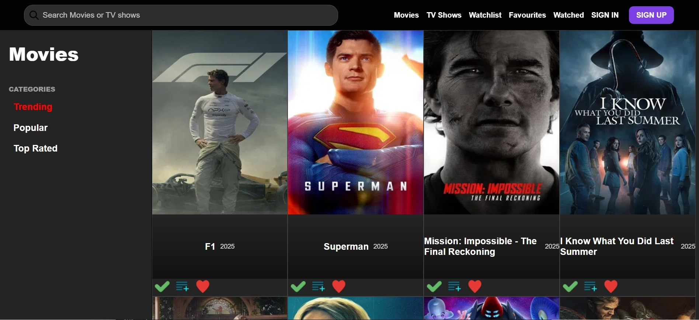
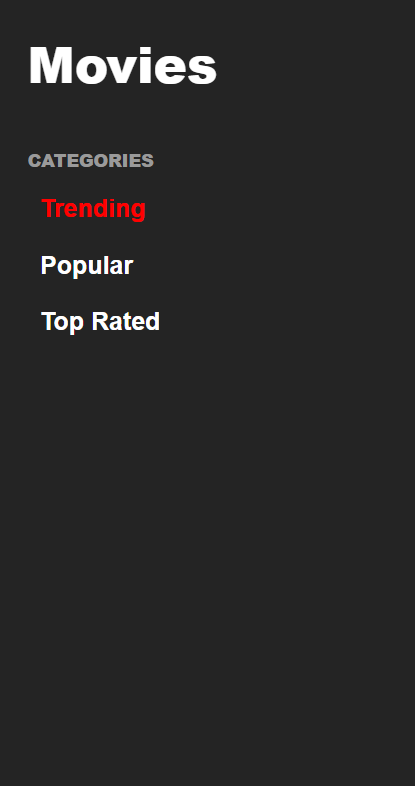
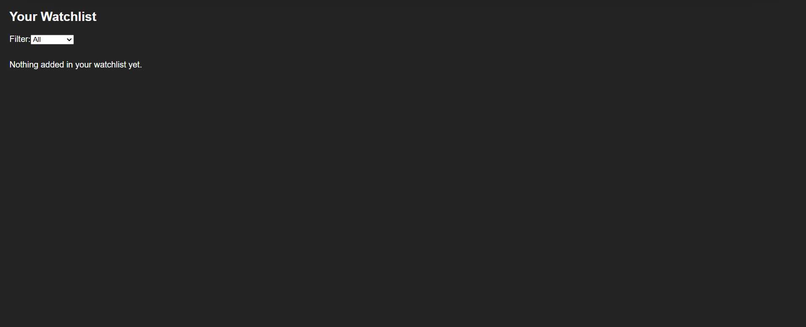
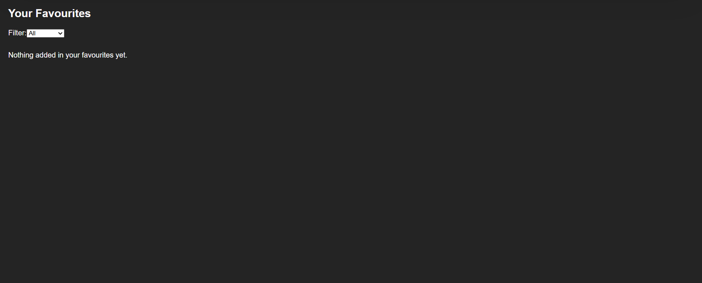
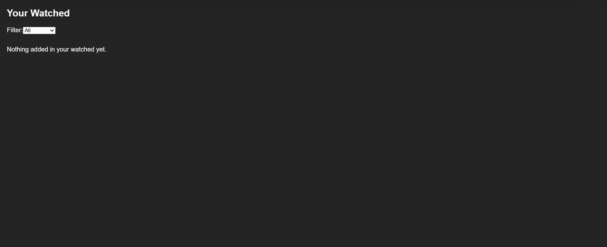
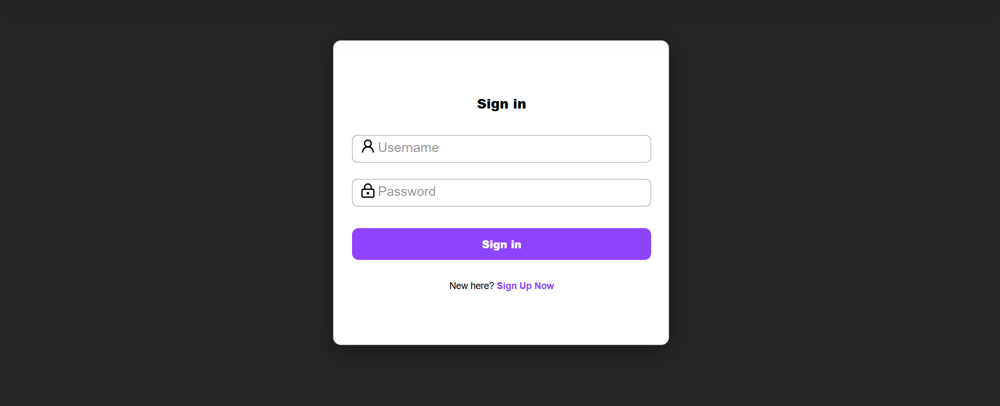
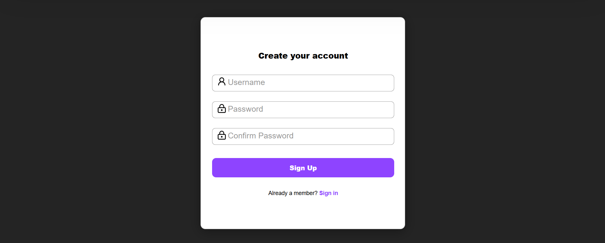

# 🎬 Media Tracker App

A full-stack **movie and TV show tracking application** built with **React (frontend)** and **Spring Boot + PostgreSQL (backend)**.  
Users can **sign up / log in**, search for movies & shows (via TMDB API), and organize their **Watchlist, Favourites, and Watched** collections.

---

## 🌐 Live Demo
- 👉 **Frontend:** [View Website Live](https://media-tracker-app-project.vercel.app/)
- 👉 **Backend API:** [Backend API Server](https://media-tracker-app-project.onrender.com)
---

## 🚀 Features
- 🔐 **User Authentication** - Secure sign up, login, and logout using session-based auth.
- 🔍 **Search** - Search for movies and TV shows powered by the **TMDB API**.
- 📑 **Categorized Browsing** - Explore trending, popular, and top-rated content.
- ❤️ **Personalized Lists**  
  - ➕ Add movies/shows to **Watchlist**  
  - ⭐ Mark items as **Favourites**  
  - ✅ Track items as **Watched**  
  - ➖ Remove them anytime
- 🖼️ **Media Cards** - Each item displays poster, title, release year, and quick actions.
- 📱 **Responsive Design** - Works on desktop, tablet, and mobile.

---

## 🛠️ Tech Stack
### Frontend
- **React** (JavaScript, Hooks, Router)  
- **TMDB API** (for fetching movies/shows data)  
- **CSS** (custom responsive styling)

### Backend
- **Spring Boot** (Java, REST API)  
- **PostgreSQL** (persistent storage)  
- **Spring Data JPA** (database interactions)  
- **Session-based Authentication**  

### Deployment
- **Frontend:** Vercel  
- **Backend:** Render

---

## 📸 Screenshots

| Home | NavBar | SideBar | Watchlist | Favourites| Watched | Sign | Sign Up |
|---|---|---|---|---|---|---|---|
|  |  |  |  |  |  |  |  |

---

## ⚙️ Installation & Setup

To run this project locally, follow these steps:

### 🔧 Backend (Spring Boot)
```bash
# 1. Clone the repository
git clone https://github.com/abdullaabdulla97/media-tracker-app-project.git
cd media-tracker-app-project/Backend

# 2. Create a PostgreSQL database (adjust name, user, password)
createdb media_tracker

# 3. Configure environment variables
# In Backend/.env (example):
DB_HOST=localhost
DB_NAME=media_tracker
DB_USER=your_db_username
DB_PASS=your_db_password
PORT=8080

# 4. Run the backend
mvnw spring-boot:run
```

### 🎨 Frontend (React)

```bash
#1. Navigate to frontend
cd ../Frontend

# 2. Install dependencies
npm install

# 3. Create a .env file to add the TMDB API key and URL for localhost
echo "REACT_APP_TMDB_API_KEY=your_tmdb_api_key_here" > .env
echo "REACT_APP_API_BASE=http://localhost:8080" > .env

# 4. Start the development server
npm start
```
---

## 📡 API Endpoints (Backend)

### Authentication

- POST /api/user/register → Register a new user

- POST /api/user/login → Log in an existing user

- POST /api/user/logout → Log out

- GET /api/user/me → Get logged-in user info

### Movies

- GET /api/movies → Get all movies

- GET /api/movies?title=Title → Search movies by title

- POST /api/movies → Add a movie

### Shows

- GET /api/shows → Get all shows

- GET /api/shows?title=Title → Search shows by title

- POST /api/shows → Add a show

### User Lists

- GET /api/user/movielist/{type}?username=... → Get user’s movie list (watchlist, favourites, watched)

- POST /api/user/movielist/{type}/add → Add movie to user’s list

- POST /api/user/movielist/{type}/remove → Remove movie from user’s list

- GET /api/user/showlist/{type}?username=... → Get user’s show list

- POST /api/user/showlist/{type}/add → Add show to user’s list

- POST /api/user/showlist/{type}/remove → Remove show from user’s list
---

## 📬 Contact
-  LinkedIn: [LinkedIn](https://www.linkedin.com/in/abdulla-abdulla-350a0937b/)  
- 📧 Email: abdulla.abdulla.salem97@gmail.com  
-  GitHub: [GitHub](https://github.com/abdullaabdulla97)

---
